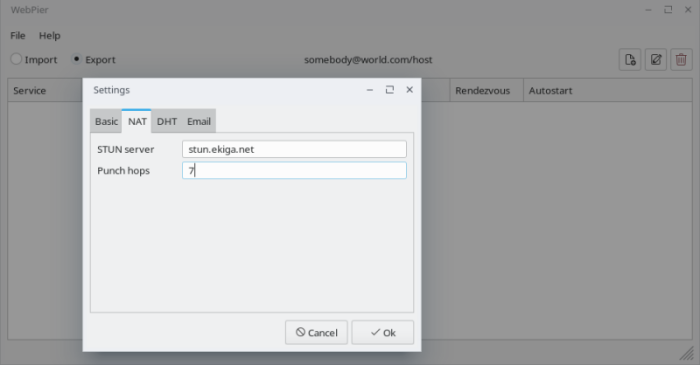
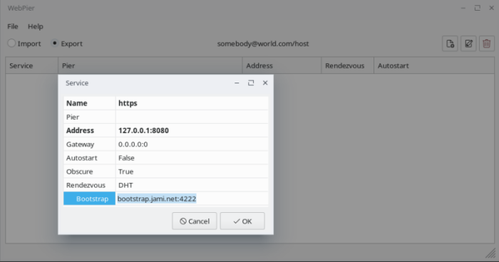
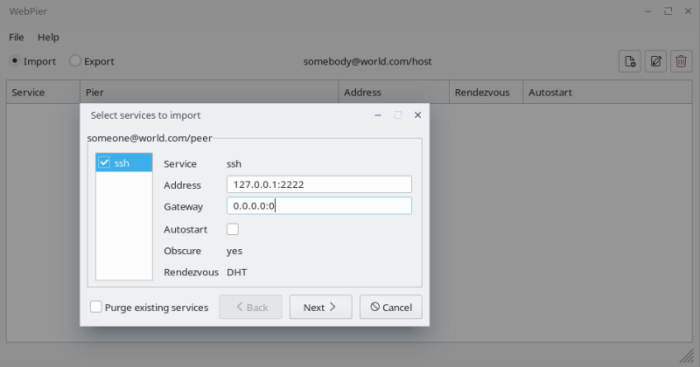

# README

This repository is dedicated to the [WebPier](https://github.com/novemus/webpier) application. This program is still in development and not all planned features have been implemented yet. But it is already in a functional state and can be used for its intended purpose.

The [WebPier](https://github.com/novemus/webpier) app is designed to exchange TCP services with remote hosts, primarily those located behind the NAT. Peers do not need to have public IP addresses and use third-party relay servers. The `WebPier` creates a direct UDP tunnel between the hosts and maps the remote TCP service to the local interface, or forwards the local TCP service to the remote side. UDP-hole-punching technique using STUN server is used to overcome NAT, and EMAIL or DHT services are used as a rendezvous for exchanging endpoints. This program is essentially a graphical shell for the [plexus](https://github.com/novemus/plexus) and [wormhole](https://github.com/novemus/wormhole) utilities and is designed to provide a user-friendly mean for managing the export/import of TCP services.

#### What are the benefits of using the WebPier?

First of all, it is safety. Traffic of your services doesn't pass through third-party servers. There is no need to make your services public. You only open them to whom you wish and verify with the public key on the stage of tunnel creation. Feature of the channel obscuration reduces the risks of attacks on the channel protocol and protocols of forwarded services. Using `WebPier` as alternative to VPN gives a better throughput because of minimal packet route and absence of packet processing on the intermediate server.

#### How about reliability?

Of course, we all have to pay for security. Due to the fact that `WebPier` does not use third-party relay servers, the possibility to create a tunnel depends on the presence or settings of NAT. The policy of mapping internal endpoint (address-port) to public NAT endpoint must be *independent*. That is, outgoing packets from some internal endpoint to external one should not change the mapped endpoint when the destination endpoint is changed, but the source endpoint remains unchanged. Fortunately, providers usually implement this policy on their NATs. If both piers are located behind the same NAT, then the *hairpin* policy must be implemented on it so that packets from the internal endpoint can be transmitted back to the internal network. Also, discovering of piers in the local network has not yet been implemented. If the above is not your case, you can successfully use the `WebPier`.

## Using

The easiest way to get started is to download and install the [prebuilt](https://github.com/novemus/webpier/releases) package for Linux, Windows and MacOS platforms.

On the first start, you will be prompted to define the local *pier* identity.


It consists from the two parts. The first one is the owner identifier, which should be your email address if you want to use the email as the rendezvous service. It can be any word in case of using DHT network as the rendezvous, but using an email address is more unified approach. In addition, this is a good way to distinguish participants and avoid naming collisions. The second part of the identity is the name of the local *pier* which must be unique for the owner. After providing the identifier, a pair of cryptographic keys will be generated. They will be used to protect rendezvous messages.

Then you have to setup some of parameters by the dialog from the *"File -> Settings..."* menu.



You must specify accessible STUN server, DHT bootstrap server or(and) your email account. Then you can add export services.



* **Name** - the name of the service to refer it in rendezvous
* **Pier** - list of remote piers to export to or remote pier to import from the service
* **Address** - IPv4 address of the exporting service or local IPv4 address to import the remote service in form XXX.XXX.XXX.XXX:PORT
* **Gateway** - local IPv4 address for the transport tunnel in form XXX.XXX.XXX.XXX:PORT
* **Autostart** - should the service forwarding be run with the application startup or manually
* **Obscure** - should the transport UDP tunnel be obfuscated, must be equal for both sides
* **Rendezvous** - selector of the preferred rendezvous, must match the remote side

After that you have to create the *offer* for your partner. Invoke the dialogs from the *"File -> Create an offer..."* menu, select your services you want to offer and save the *offer* file. The *offer* will also contain public key of your pier. 


Send the *offer* to your partner, retrieve the counter *offer* and adopt it by the dialog from *"File -> Upload an offer..."* menu. Choose from offered services that you want to import and mark your services that you want to share.



Your partner must adopt your *offer* too. After that you can manage the services from the context menu or from the desktop tray. It takes some time to establish a tunnel. You will be notified about the tunnel status and service indicator will change color. The services can be created and edited later, but their parameters must be synchronized with the remote piers. It is not necessary to exchange offers again.

## Build

To build the project from the source you will need to provide the following dependencies: [plexus](https://github.com/novemus/plexus), [wormhole](https://github.com/novemus/wormhole), [wxWidgets](https://github.com/wxWidgets/wxWidgets), [openssl](https://github.com/openssl/openssl), [boost](https://github.com/boostorg/boost) libraries and their interface dependencies. For example, `plexus` library also needs the [tubus](https://github.com/novemus/tubus) and [opendht](https://github.com/savoirfairelinux/opendht) library with their own dependencies. If that doesn't scare you then try to build the project.

Note that the `CMakePresets.json` directs the build output to the `out` directory next to the project source folder. The CPack presets are based on the static release build.

The Linux CMake presets assume that the dependencies are installed and accessible via CMAKE_PREFIX_PATH and PKG_CONFIG_PATH variables or located in the default install directory, which is set as `${sourceParentDir}/out/$env{HOSTNAME}/install/x64-static` for the static build and `${sourceParentDir}/out/$env{HOSTNAME}/install/x64` for the shared build.

```console
$ git clone https://github.com/novemus/webpier.git
$ cd webpier
$ cmake --preset=linux-static-release
$ cpack --preset=debian-package
```

The MacOS and Windows presets are based on the [vcpkg](https://vcpkg.io) tool chain to install and resolve dependencies, except of the [opendht](https://github.com/savoirfairelinux/opendht), [tubus](https://github.com/novemus/tubus), [plexus](https://github.com/novemus/plexus) and [wormhole](https://github.com/novemus/wormhole) libraries. You have to install them yourself, for example to the default install directory, which is set in the corresponding configure preset.

```console
$ git clone https://github.com/novemus/webpier.git
$ set VCPKG_ROOT=/path/to/vcpkg/root
$ cd webpier
$ cmake --preset=darwin-static-release # windows-static-release
$ cpack --preset=darwin-pkg # windows-msi
```

## Bugs and improvements

Feel free to [report](https://github.com/novemus/webpier/issues) bugs and [suggest](https://github.com/novemus/webpier/issues) improvements. 

## License

`WebPier` is licensed under the Apache License 2.0, which means that you are free to get and use it for commercial and non-commercial purposes as long as you fulfill its conditions. See the LICENSE.txt file for more details.

## Copyright

Copyright © 2025 Novemus Band. All Rights Reserved.
